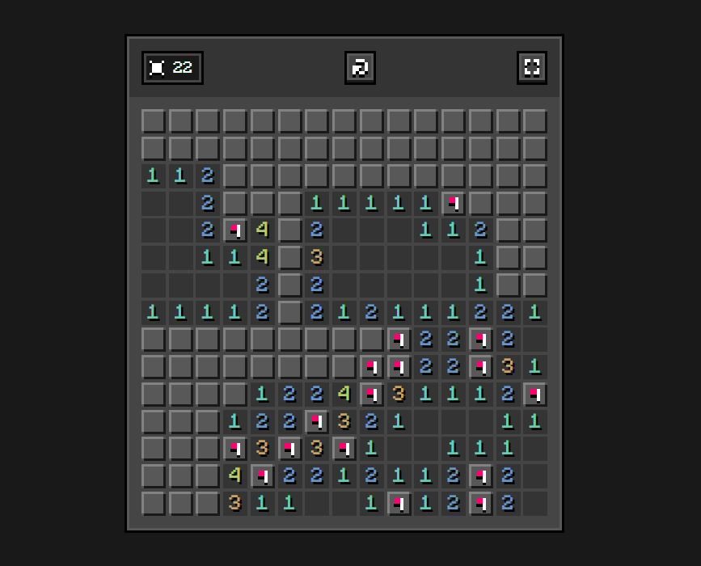

---

### Simple minesweeper

This is a classic minesweeper game that runs on the browser. The grid size and mine count can be adjusted, but otherwise the funcionality is very minimal. Interface design is inspired by Ore UI.

---

### Link

> https://martzin23.github.io/simple-minesweeper/

---

### Controls

Click (<kbd>LMB</kbd>) to reveal a cell or press and hold to place a flag. The controls work the same on a touch screen. If on PC, <kbd>RMB</kbd> can place a place flag instantly.

---

### Screenshot

---

